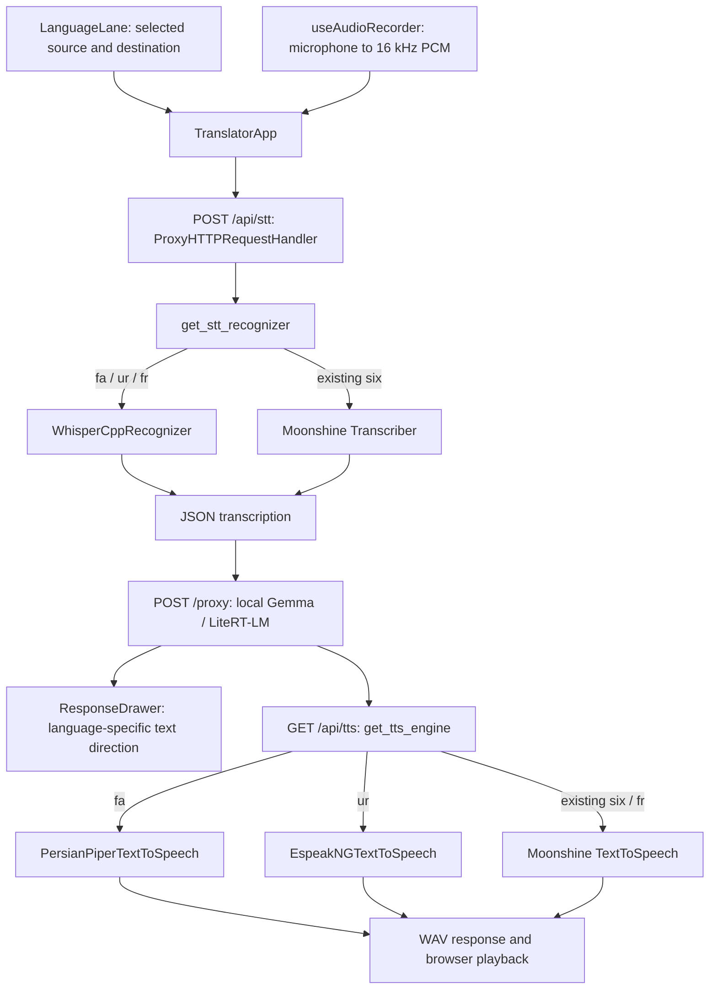

# French, Persian and Urdu offline language support

## Engines and API compatibility

| Language | Speech recognition | Speech output | Text direction |
| --- | --- | --- | --- |
| Persian (`fa`) | Shared multilingual whisper.cpp server, explicit `fa` | Piper `fa_IR-amir-medium` by default | RTL |
| Urdu (`ur`) | Same resident Whisper model, explicit `ur` | eSpeak NG's `ur` voice | RTL |
| French (`fr`) | Same resident Whisper model, explicit `fr` | Moonshine French (`fr-fr`) | LTR |
| Arabic, English, Spanish, Japanese, Chinese, Korean | Existing Moonshine recognizers | Existing Moonshine voices, including the Chinese override | Arabic RTL; others LTR |

All nine languages use the existing push-to-talk capture and local Gemma/LiteRT-LM translation service. Either lane can be the source or destination. The frontend sends the selected source code in `POST /api/stt` and the destination code in `GET /api/tts`. Transcription responses remain `{"text":"..."}`; speech responses remain mono 16-bit PCM WAV. The backend automatically converts browser Float32 PCM into a 16 kHz WAV in memory for the persistent Whisper server. Optional CLI mode uses a temporary WAV and deletes it afterward. Whisper performs transcription; Gemma still performs translation. See [performance configuration and measurement](PERFORMANCE.md) for the resident worker, startup warmup, and speech prefetch.



Persian and Urdu never select an English recognizer or voice. Missing binaries/models produce an actionable error (normally HTTP 503), visible in the result panel for STT and a speech-output alert for TTS. Runtime speech code does not download anything. Existing Moonshine STT reads a setup-generated local manifest; existing Moonshine TTS is constructed with `download=False`.

## Why these TTS engines

French is supported by the pinned Moonshine TTS [asset catalog](https://github.com/moonshine-ai/moonshine/blob/v0.0.65/core/moonshine-tts/src/moonshine-asset-catalog.cpp) as `fr-fr`. The pinned STT model catalog has no French recognizer, so French input shares the existing multilingual Whisper model. Setup downloads French TTS independently from the Moonshine STT languages and synthesizes a French sentence to verify it. No additional Whisper model or runtime dependency is required.

The pinned `moonshine-voice==0.0.65` integration has no Persian/Urdu voice configured, and its published TTS language list does not include either language. A better Persian option is available in the [Piper voice catalog](https://huggingface.co/rhasspy/piper-voices/blob/main/voices.json): `fa_IR-amir-medium`. It is automatically installed instead of using a synthetic voice for Persian. [Piper 1.4.2](https://pypi.org/project/piper-tts/1.4.2/) provides an ARM64 wheel and CPU inference. Its model/config are loaded locally and participate in the existing two-engine LRU cache.

That catalog has no Urdu voice. The project does not include a suitable neural Urdu voice/runtime, so Urdu uses the explicitly supported `ur` voice from [eSpeak NG's language list](https://github.com/espeak-ng/espeak-ng/blob/master/docs/languages.md). It is compact and synthetic; expect a different sound from the neural voices. Setup checks the installed binary's actual voice list and synthesizes a native-language sentence, so an older distribution lacking Urdu fails setup rather than speaking English.

Persian can explicitly use eSpeak NG with `PERSIAN_TTS_ENGINE=espeak-ng` to reduce resource use. This uses `-v fa`, not an English voice. The default remains Piper. Piper is GPL-3.0-or-later; the downloaded `MODEL_CARD` records the Persian voice dataset's CC0 license. Existing engine/model licenses remain unchanged.

## Fresh Raspberry Pi installation

Target: Raspberry Pi 5, 8 GB RAM, Raspberry Pi OS 64-bit / Debian ARM64. Run as the normal desktop user, with sudo available, while connected to the internet:

```bash
chmod +x setup.sh download_model.sh start.sh deploy-pi.sh
./deploy-pi.sh
```

No separate Persian/Urdu download command is needed. Deployment invokes `setup.sh`, which:

1. Installs Debian dependencies including compiler/CMake/Git, eSpeak NG and its language data, PortAudio/ALSA libraries, and offline Arabic-script/CJK fonts.
2. Creates the Python venv and installs requirements, including Piper.
3. Builds CPU-only whisper.cpp `v1.8.3` CLI and server (unless both configured executables already exist).
4. Downloads a multilingual `ggml-small-q5_1.bin` model, shared by French/Persian/Urdu.
5. Downloads the Persian Piper ONNX/config/model card from a pinned catalog revision.
6. Synthesizes French/Persian/Urdu setup checks and downloads STT/TTS assets for all six existing Moonshine languages, plus French TTS assets.

Deployment then installs/builds the frontend, imports the Gemma model, and configures the existing service/kiosk. Disconnect only after all steps complete successfully.

For manual startup without installing the service, run these while online:

```bash
./setup.sh
./download_model.sh
npm --prefix frontend ci
npm --prefix frontend run build
./start.sh --prod
```

`./setup.sh` fixes the previous hash-enforcement mismatch: requirements are version-pinned without hashes, so pip no longer requests `--require-hashes`. NumPy pins are conditional because 2.5.1 requires Python 3.12; Bookworm/Python 3.11 uses 2.4.6. This preserves the model engine versions. Setup failures stop deployment; they are not silently skipped.

All downloaded speech data lives by default in `models/offline-speech/` inside the checkout (ignored by Git). Keep that directory on the appliance. Gemma is still imported by the existing downloader into LiteRT-LM's storage. Startup no longer waits for an internet ping.

After a frontend edit, explicitly rebuild with `npm --prefix frontend run build` before restarting production; the existing launcher otherwise reuses an already present dist directory.

## Configuration and existing models

Copy `speech.env.example` to `speech.env` **before setup** to persist overrides. Use simple `KEY=value` assignments and absolute paths, because systemd EnvironmentFile does not expand `~` or shell variables. Both setup/startup and the systemd service read this file. Existing deployments can rerun `./deploy-pi.sh` to install the updated service template.

| Variable | Default / purpose |
| --- | --- |
| `OFFLINE_SPEECH_DIR` | `<project>/models/offline-speech`; parent for all speech assets and the Moonshine manifest. |
| `WHISPER_CPP_BINARY` | `<speech dir>/whisper.cpp/build/bin/whisper-cli`; may also be an executable name on PATH. |
| `WHISPER_SERVER_BINARY` | `<speech dir>/whisper.cpp/build/bin/whisper-server`; persistent multilingual worker. |
| `WHISPER_MODE` | `auto` prefers the installed server; `server` requires it; `cli` releases memory per utterance. |
| `WHISPER_MODEL_PATH` | `<speech dir>/whisper/ggml-small-q5_1.bin`; set to an existing multilingual GGML model to reuse it. |
| `WHISPER_THREADS` | 4 CPU threads. |
| `WHISPER_BUILD_JOBS` | 2 compile jobs during setup. |
| `SPEECH_TIMEOUT_SECONDS` | 300 per local executable operation. |
| `PERSIAN_TTS_ENGINE` | `piper` (default) or `espeak-ng`. |
| `PIPER_FA_MODEL` | `<speech dir>/piper/fa_IR-amir-medium.onnx`. |
| `PIPER_FA_CONFIG` | Model path plus `.json`; must describe a Persian `fa` phonemizer. |
| `ESPEAK_NG_BINARY` | `espeak-ng` on PATH. |
| `SPEECH_PREWARM_LANGUAGES` | `ar,en`; at most two codes to preload at startup, or empty to disable. |
| `GEMMA_WARMUP` | `1`; one small local startup completion, `0` to skip. |
| `GEMMA_MODEL_NAME` | `gemma4-e2b`; must match the model used in Settings. |
| `GEMMA_WARMUP_TIMEOUT_SECONDS` | `120`; startup completion timeout. |

Custom Whisper model paths must already exist; unset the override to use the automated download. English-only `.en` models and non-GGML formats are rejected using the model header. Custom Piper paths must include both a local ONNX model and matching config. No user home directory is hard-coded.

Whisper normally keeps one multilingual model loaded in a local CPU subprocess shared by French/Persian/Urdu. Explicit CLI mode releases it after each utterance. The existing STT/TTS locks serialize same-type requests and two-entry engine caches remain bounded. Larger Whisper models may improve recognition but cost memory and latency. Evaluate whole-app RAM, timing, and linguistic accuracy on the Pi; small-model accuracy, especially Urdu, is not guaranteed for every accent or noisy environment.

On a non-Debian platform, provide Python/venv, a C++ toolchain/Git/CMake, and eSpeak NG yourself, or configure existing binaries. The automated apt/systemd path targets Raspberry Pi OS; it is not a native Windows deployment script.

## Verify from the existing UI

1. Open `http://localhost:3000` on the Pi after deployment, and enable **Speech Output** in Settings.
2. In landscape keyboard mode, use Space to select a lane and arrows to set English on one lane and Persian on the other. Hold Z on the English lane, say “Hello, how are you?”, and release. Expect Persian text in an RTL bubble and automatic Persian speech.
3. Switch to the Persian lane with Space, hold Z, say “سلام، حال شما چطور است؟”, and release. Expect English text and speech.
4. Replace Persian with Urdu; test English → Urdu, then hold the Urdu lane's recording key and say “السلام علیکم، آپ کیسے ہیں؟” for Urdu → English.
5. Select Urdu and Persian together and test both directions. Repeat with Arabic or another existing language; there are no special source/destination restrictions beyond the original rule that lanes have different languages.
6. Vertical keyboard mode uses the same languages and pipeline: Z for lane 1, X for lane 2; arrows and minus/plus rotate the corresponding lane. This mode still uses the fixed landscape screen layout.
7. Disconnect Wi-Fi/Ethernet, restart the app, and repeat the checks. No microphone recording file needs to be created manually. Allow the recognition/translation result to complete before the next utterance when assessing language quality.

Labels remain English/LTR; only Arabic/Persian/Urdu speech text receives RTL direction and Arabic-script font fallback. The frame/lane layout stays unchanged.

Check engine logs with `journalctl -u gemma-translator.service -f`, or the launch terminal:

```text
[STT] lang=fa engine=whisper.cpp/server
[STT] lang=ur engine=whisper.cpp/server
[TTS] lang=fa engine=piper
[TTS] lang=ur engine=espeak-ng
```

Optional direct voice diagnostics (these save output audio, not microphone recordings):

```bash
curl --fail --get --data-urlencode 'text=سلام، حال شما چطور است؟' \
  --data-urlencode 'lang=fa' http://localhost:3000/api/tts -o /tmp/persian.wav
curl --fail --get --data-urlencode 'text=آپ کیسے ہیں؟' \
  --data-urlencode 'lang=ur' http://localhost:3000/api/tts -o /tmp/urdu.wav
aplay /tmp/persian.wav
aplay /tmp/urdu.wav
```

## Tests and troubleshooting

```bash
venv/bin/python -m unittest discover -s backend/tests -v
npm --prefix frontend test
npm --prefix frontend run build

# Real local voice smoke test after setup, including while disconnected:
RUN_OFFLINE_SPEECH_SMOKE=1 venv/bin/python -m unittest discover -s backend/tests -v
```

Unit tests use fake native engines to verify PCM conversion, forced language flags, all existing language routes, cache bounds, no runtime downloads, WAV responses, invalid models/voices, missing dependencies, and error propagation. Frontend tests check all 72 directed language pairs, selected STT/TTS codes, RTL metadata, and model prompts. The opt-in real test synthesizes French/Persian/Urdu using the installed engines; setup performs that check too.

- **Missing executable:** rerun setup, or correct WHISPER_CPP_BINARY/ESPEAK_NG_BINARY in speech.env.
- **Missing/wrong Whisper model:** use a multilingual `ggml-*.bin`, not an English `.en` model or a GGUF model.
- **Setup reports a missing `blobs/<hash>` model path:** an older downloader linked a relative Hugging Face cache symlink instead of its model data. Run `git pull --ff-only`, then rerun `./setup.sh` while online. The corrected downloader resolves the cache source and replaces broken model links in place; no manual deletion or Gemma re-download is required.
- **Missing Persian voice:** rerun setup to download the ONNX/config pair; confirm custom model config uses `espeak.voice=fa`.
- **No Urdu voice:** run `espeak-ng --voices=ur`; install Debian's espeak-ng and espeak-ng-data packages.
- **Missing Moonshine manifest/voice assets:** rerun setup using the same OFFLINE_SPEECH_DIR as runtime. Old clones with only the Gemma model now need this one-time speech preload to work offline in every language.
- **French voice assets missing after updating:** rerun `./setup.sh` while online and rebuild the frontend. Then select French in either lane and test “Bonjour, comment allez-vous ?” in both directions with another language. French remains LTR. Its logs show `[STT] lang=fr engine=whisper.cpp/server` and `[TTS] lang=fr engine=moonshine-voice`.
- **Slow recognition:** shorten utterances or configure a smaller multilingual Whisper model. The default is quantized small with four CPU threads; there is no measured Pi latency claim.
- **Microphone permission failure:** use the local Chromium kiosk or a secure browser context; remote plain HTTP microphone restrictions still apply.

The development host checks cover Python dependency resolution, ARM64 wheels for the pinned packages, Python unit tests, frontend tests/build, Bash syntax, rendered RTL markup, and an actual Persian Piper synthesis. Raspberry Pi execution, real microphone recognition, Urdu audio quality, and the complete model/setup download sequence still require the device checks above.

## Changed files

- Backend: `backend/server.py`, `backend/offline_speech.py`, `backend/whisper_server.py`, `backend/setup_speech.py`, `backend/warmup.py`, `backend/requirements.txt`.
- Frontend: `frontend/src/TranslatorApp.jsx`, `frontend/src/components/ResponseDrawer.jsx`, `frontend/src/utils/languages.js`, `frontend/src/utils/api.js`, `frontend/src/utils/speech-player.js`, `frontend/style.css`, `frontend/package.json`.
- Installation/startup: `setup.sh`, `setup-offline-speech.sh`, `start.sh`, `deploy-pi.sh`, `deploy/gemma-translator.service`, `speech.env.example`.
- Tests: `backend/tests/test_offline_speech.py`, `backend/tests/test_setup_downloads.py`, `backend/tests/test_whisper_server.py`, `backend/tests/test_warmup.py`, `frontend/tests/languages.test.js`, `frontend/tests/rtl.test.js`, `frontend/tests/translation.test.js`, `frontend/tests/speech-player.test.js`.
- Documentation/checkout configuration: `README.md`, this guide, `.gitignore`, `.gitattributes`. Shell files now retain Unix line endings on Windows checkouts. The earlier `docs/PROJECT_ANALYSIS.md` remains available for the original repository architecture.
