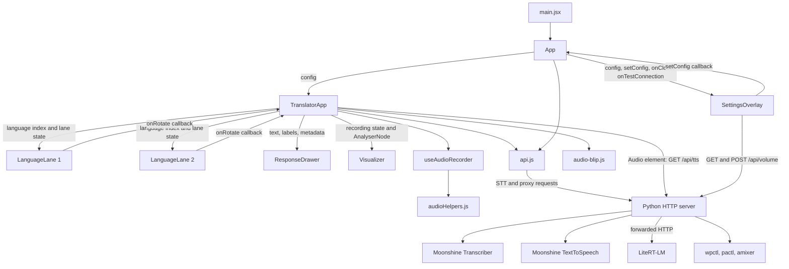
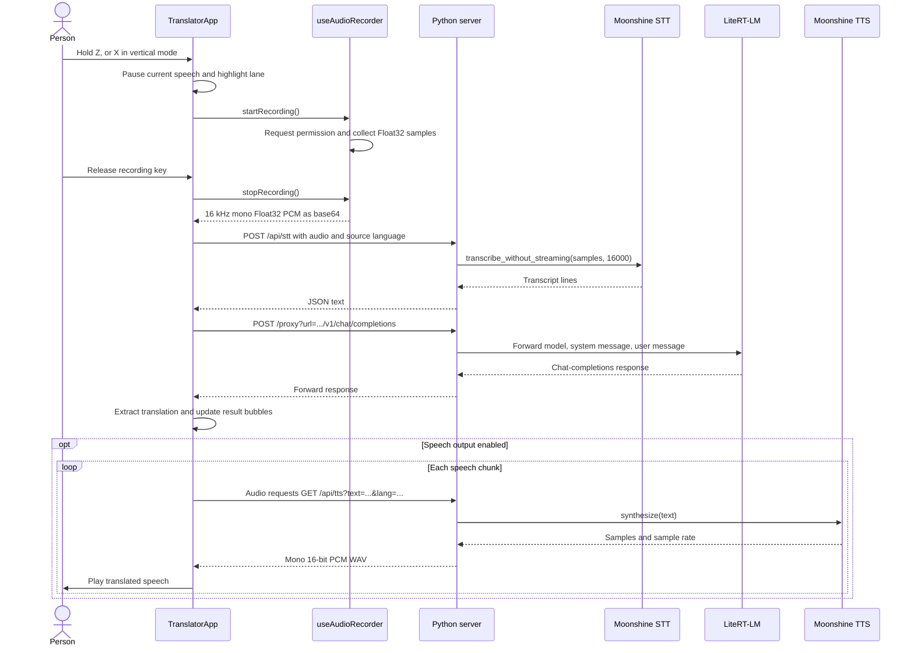

# Gemma Translator: complete project walkthrough

Reviewed against the working tree on October 5, 2026. This report describes the actual local implementation. It does not assume that README claims, code comments, or external libraries' behavior have been independently verified.

## 1. What the project does

This is a two-person voice translator intended for a Raspberry Pi kiosk. Each person has a selected language. Holding a keyboard key captures microphone audio; releasing it starts speech recognition, translation into the other person's language, and optional spoken playback.

There are three runtime layers:

1. **React in Chromium:** captures microphone audio, owns settings and interaction state, requests transcription and translation, displays results, and plays speech.
2. **Python HTTP server on port 3000:** hosts speech models, exposes the local API, forwards LLM requests, controls system volume, and serves built frontend assets in production.
3. **LiteRT-LM service on expected port 9379:** runs the imported `gemma4-e2b` model and exposes an OpenAI-compatible API. Its implementation is an external dependency, not code in this repository.

Development adds a fourth process: Vite on port 5173. Production serves the compiled React application through Python.

There is **one project-defined Python class**, `ProxyHTTPRequestHandler`, and **six React function components**: `App`, `TranslatorApp`, `SettingsOverlay`, `LanguageLane`, `ResponseDrawer`, and `Visualizer`. Frontend communication uses props, callbacks, React state, refs, and HTTP. There are no frontend class components, database, application router, authentication layer, WebSockets, or central state library.

## 2. Complete file map

| File | Responsibility |
| --- | --- |
| `frontend/index.html` | HTML shell containing `#root` and the module entry point. |
| `frontend/src/main.jsx` | Imports fonts/styles, creates the React root, renders `App` under `StrictMode`. |
| `frontend/src/App.jsx` | Owns global configuration, settings visibility, connection probe, theme and keyboard persistence. |
| `frontend/src/TranslatorApp.jsx` | Coordinates lanes, keyboard interaction, recording, transcription, translation, and speech playback. |
| `frontend/src/hooks/useAudioRecorder.js` | Browser microphone and Web Audio lifecycle; produces base64 Float32 PCM. |
| `frontend/src/components/LanguageLane.jsx` | Language selector and lane highlights. |
| `frontend/src/components/ResponseDrawer.jsx` | Source and translated text bubbles, placeholder, hidden metadata. |
| `frontend/src/components/Visualizer.jsx` | Draws microphone frequency bars for each person on two canvases. |
| `frontend/src/components/SettingsOverlay.jsx` | Settings form and system volume requests. |
| `frontend/src/utils/api.js` | HTTP requests, LLM message construction, response parsing, speech chunking. |
| `frontend/src/utils/audioHelpers.js` | Concatenates samples, resamples, encodes blobs as base64. |
| `frontend/src/utils/audio-blip.js` | Synthesizes short interaction sounds. |
| `frontend/style.css` | Fixed kiosk layout, theme variables, lane states, chat bubbles, settings styling. |
| `frontend/vite.config.js` | React plugin and development proxies to Python. |
| `frontend/package.json` | Frontend dependencies and `dev`, `build`, `preview`, `format` commands. |
| `frontend/package-lock.json` | npm lockfile v3; 136 package entries including the root entry. |
| `backend/server.py` | All project-owned backend logic. |
| `backend/requirements.txt` | 41 exactly pinned Python requirements; no hashes. |
| `setup.sh` | Creates and activates `venv`, then installs Python dependencies. |
| `download_model.sh` | Checks for the imported model, checks free space, imports from Hugging Face. |
| `start.sh` | Starts and supervises application processes in dev or production mode. |
| `deploy-pi.sh` | Installs OS packages, builds frontend, imports model, registers service, configures kiosk autostart. |
| `deploy/gemma-translator.service` | systemd template with user, project directory, and UID placeholders. |
| `stl/front-face.stl` | Binary STL front panel: 7,934 triangles. |
| `stl/main-body.stl` | Binary STL enclosure body: 136,540 triangles. |
| `stl/speaker-support.stl` | Binary STL speaker support: 18,714 triangles. |
| `.gitignore` | Excludes dependency directories, build output, environments, logs, models, audio recordings, coverage. |
| `README.md` | Purpose, installation, hardware, deployment, keyboard instructions, credits. |
| `CONTRIBUTING.md` | Contribution and review process. |
| `CODEOWNERS` | Assigns all repository paths to `@alanvww` and `@dmotz`. |
| `LICENSE` | Apache License 2.0 text. |

The STL files are physical hardware assets. Nothing in the application loads them. Their triangle counts and expected binary file sizes were checked; printability, dimensions, and mechanical fit were not evaluated.

No test suite, CI workflow, Docker configuration, TypeScript configuration, or lint configuration is checked in. There are 31 tracked files before this report, including 11 frontend source files. No `AGENTS.md` was found in the repository or checked ancestor directories.

## 3. How the components communicate



Children do not directly mutate their parents' state. For example, `SettingsOverlay.handleChange()` calls the `setConfig` prop; `App` updates state; React renders `TranslatorApp` with the new config. Likewise, `LanguageLane.handleNext()` invokes `onRotate(1)`; `TranslatorApp` calculates the next permitted language and passes the updated index down.

The visualizer receives an actual browser `AnalyserNode`, not serialized audio or an HTTP response. Speech playback bypasses `api.js`: `TranslatorApp` gives the TTS URL directly to an `Audio` element.

The Python class does not call frontend functions. It returns HTTP responses. React does not instantiate the Python class or speech engines. Those boundaries are process boundaries.

## 4. End-to-end execution



The source and destination languages come from the recorded lane: lane 1 translates language 1 into language 2; lane 2 reverses that direction. Initial selections are Arabic and English. Every translation is independent: the LLM receives a new system/user pair, with no conversation history.

Empty transcription stops the pipeline before the LLM. Transcription/translation errors update the result panel. TTS failures use an alert or console log instead of that same panel.

## 5. Frontend entry and application shell

### `main.jsx`

There are no local named functions. Top-level execution loads Roboto Mono weights 400, 500, and 700, imports global CSS, creates a React root on `#root`, and renders `App` in `React.StrictMode`.

Development StrictMode can repeat mount effects to help expose lifecycle issues. The initial connection probe may therefore run twice during development. It does not mean the production app deliberately starts two backend processes.

### `App()` — `App.jsx:25`

Owns two state values: `config` and `isSettingsOpen`. It renders the settings button, `TranslatorApp`, and `SettingsOverlay`.

| Config field | Initial value | Usage and persistence |
| --- | --- | --- |
| `endpointUrl` | `http://localhost:9379/v1` | Used by connection testing and translation; memory only. |
| `modelName` | `gemma4-e2b` | LLM model ID; memory only. |
| `apiKey` | empty string | Optional Bearer header for LLM requests; memory only. |
| `keyboardMode` | saved value or `landscape` | Keyboard mapping; saved in localStorage. |
| `useProxy` | `true` | Determines LLM request routing; no visible settings control. |
| `enableTts` | `true` | Enables automatic speech playback; memory only. |
| `visualizerBars` | `16` | Visualizer density; slider can turn it into a string; parent parses it. |
| `systemPrompt` | `Translator mode` | Replaced by a language-specific prompt for actual translations. |
| `themeColor` | saved value or `#ffa500` | CSS background color; saved in localStorage. |

**`testConnection()` — line 41:** awaits `testConnectionAPI()` using current endpoint/proxy/key. It catches errors and discards them. It does not store success, failure, or loading state, so the Test button gives no visible result.

**Initial effect — line 53:** invokes `testConnection()` on mount only. Config edits do not automatically trigger it.

**Keyboard persistence effect — line 57:** writes `config.keyboardMode` to localStorage whenever it changes.

**Theme effect — line 61:** writes `config.themeColor` to the document root's `--bg-black` variable and localStorage. Despite the variable name, it controls the colored background.

Inline callbacks open/close settings. The settings overlay receives the config setter directly, allowing any exposed field to update immediately. There is no Save/Cancel transaction.

## 6. Translation coordinator: every function and effect

### `TranslatorApp({ config })` — `TranslatorApp.jsx:43`

This is the main behavioral component. `AVAILABLE_LANGUAGES` lists Arabic, English, Spanish, Japanese, Chinese, and Korean in that order. Each record has `code`, `name`, `voice`, and `ttsLang`; `voice` is unused.

| State/ref | Meaning |
| --- | --- |
| `isDrawerOpen` | Activates result display after recording or microphone error. |
| `activePerson` | Lane receiving landscape keyboard commands, initially 1. |
| `transcriptionData` | Source label and recognized/progress text. |
| `translationData` | Destination label and translated/progress/error text. |
| `metaText` | LLM request duration and total tokens. |
| `lang1Index`, `lang2Index` | Current selections, initially 0 and 1. |
| `activeLaneRecording` | Lane being captured, or null. |
| `onlineAudioPlayerRef` | Current TTS `Audio` element; updating it does not render React. |

It obtains recording state, start/stop functions, analyser, and microphone error from `useAudioRecorder()`.

**Microphone error effect — line 70:** opens results and displays `Microphone / Access Failed` plus the error and an HTTPS hint. The hint is appended regardless of the real cause.

**`stopSpeaking()` — line 81:** pauses the referenced `Audio` element and clears the ref. It does not abort backend synthesis, clear old event handlers, or cancel a translation request.

**`playTTS(text, targetLang)` — line 90:** returns early for falsy text, stops current speech, splits text into chunks, and starts playback. It closes over a local `chunkIndex`.

**Nested `playNextChunk()` — line 100:** ends the chain when all chunks are played; otherwise creates an `Audio` element with `/api/tts`, sets volume to 1, stores it in the ref, installs events, and calls `play()`.

- `onended` increments the index and requests the next chunk.
- `onerror` stops speech and shows a backend-offline alert, even though other causes are possible.
- The rejected `play()` promise logs the failure and stops playback.

This is sequential, complete-chunk synthesis, not streaming TTS. The next chunk is only requested after the prior one ends, so synthesis/network gaps can occur.

**`handleRotateLanguage(lane, direction)` — line 131:** refuses changes while `isRecording`; plays a blip; wraps the index modulo six; skips the language currently selected by the other person. It supports `direction` values -1/+1 as used by callers. The parent provides the global recording guard, while each child only knows its own lane's highlight state.

**`handleRecordStart(lane)` — line 152:** refuses an already active recording, pauses speech, changes active person, optionally plays the speaker-switch blip, highlights the lane, plays the recording ping, and awaits hook initialization. Failure clears the lane highlight. Recording is not marked true until microphone initialization finishes.

**`handleRecordStop()` — line 172:** checks recording state, saves the lane ID, clears the highlight, awaits audio conversion, and invokes `processTranslation()` if data exists. It does not await the translation pipeline and does not mark the app busy.

**`processTranslation(lane, base64Data)` — line 185:** opens results; determines source/destination from the render's language indices; shows progress text; calls STT; displays recognized text; stops for blank transcription; creates a strict JSON translation prompt; calls the LLM; displays translation and metadata; optionally invokes TTS. Its catch block preserves successful transcription but replaces `Listening...` with a transcription-failed message when STT fails.

The prompt asks for only `{"translation":"..."}` and names both languages. There is no enforced response schema in the request. The request includes `config`, but its `systemPrompt` is overridden.

**Keyboard effect — line 248:** registers `keydown`/`keyup` on `window` and removes them on cleanup. Dependencies cause listeners to be rebuilt when relevant state/callbacks change.

**Nested `handleKeyDown(e)` — line 249:** ignores INPUT, TEXTAREA, and SELECT targets; lowercases the key; handles the mapping below; prevents default browser actions. `e.repeat` is checked for recording keys, but Space can repeatedly switch lanes when held.

**Nested `handleKeyUp(e)` — line 293:** applies the same input focus guard and stops the matching recording. Landscape only checks Z; vertical checks Z with lane 1 and X with lane 2.

| Mode | Keys |
| --- | --- |
| Landscape | Space switches active person; Z records that person; left/right change that person's language. |
| Vertical | Z records lane 1, X lane 2; arrows change lane 1; minus/underscore and plus/equals change lane 2. |

Vertical mode changes input mapping and selection brackets. It does **not** rotate the fixed landscape screen layout.

Render callbacks forward lane rotation to the coordinator and clear `isDrawerOpen` through `ResponseDrawer.onClose`. That close control is hidden in the current drawer.

## 7. Microphone hook and audio utilities

### `useAudioRecorder()` — `useAudioRecorder.js:26`

State holds `isRecording` and `micError`. Refs hold the audio context, analyser, microphone source, script processor, media stream, and sample chunks. Refs store long-lived browser objects without triggering renders.

**Unmount cleanup effect — line 37:** closes a non-closed audio context. It does not stop stream tracks or explicitly disconnect the graph.

**`startRecording()` — line 45:** clears errors; awaits `getUserMedia({audio:true})`; creates/resumes an AudioContext; connects the microphone to an analyser with `fftSize=256`; creates a 4096-frame, one-input/one-output ScriptProcessor; resets sample storage; connects the processor to the context destination; marks recording true. It returns true or catches/logs an error, stores its message, and returns false.

**`scriptProcessor.onaudioprocess(e)` — line 71:** reads channel 0 and copies it into a new Float32Array. Copying matters because the callback's input buffer can be reused by the browser.

```text
MediaStreamSource ──┬──> AnalyserNode ──> Visualizer reads frequency bins
                    └──> ScriptProcessorNode ──> AudioContext destination
                               └── copies input samples into an array
```

No input samples are copied to the processor's output buffer by this implementation. The destination connection drives processing; it is not deliberate microphone monitoring code.

**`stopRecording()` — line 89:** returns if not recording; sets recording false; stops microphone tracks; disconnects processor/source/analyser; records the context sample rate; closes the context; returns null for no samples; merges sample chunks; resamples to 16000 Hz; wraps raw Float32 bytes in a Blob; base64-encodes it; returns `{rawBlob, base64Data}`. Only the Blob encoding operation is inside its final try/catch.

The hook returns `setMicError` too, but the coordinator does not use it. Only `base64Data` is used by the translation pipeline; `rawBlob` is available but unused there. The analyser ref is not cleared at stop, although the visualizer stops animating through recording state.

### `audioHelpers.js`

**`getMergedSamples(recordedSamples)` — line 20:** totals chunk lengths, allocates one Float32Array, and copies each chunk using `set()` and an offset. Time and output allocation grow linearly with total samples.

**`resample(audioBuffer, originalSampleRate, targetSampleRate)` — line 35:** returns the original array when rates match. Otherwise computes the ratio, rounds the output length, and linearly interpolates neighboring input samples. It has no anti-alias filtering or validation of rates. At the application's normal downsampling ratios it provides a simple conversion; it is not a general high-quality resampler.

**`blobToBase64(blob)` — line 55:** returns a Promise, uses FileReader to generate a data URL, resolves with the portion after the comma, and rejects on read errors.

The transmitted audio is **raw Float32 PCM**, not WAV, MP3, or WebM. At 16 kHz it is about 64,000 raw bytes per second; base64 makes it about 85,333 bytes per second before JSON overhead. Longer recordings also occupy capture, merged, resampled, Blob, and encoded buffers at different stages. No recording length or payload limit is enforced.

## 8. API utilities: every function

### `getNormalizedBaseUrl(endpointUrl)` — `api.js:22`

Trims whitespace, defaults an empty value to the local `/v1` URL, strips trailing slashes, and appends `/v1` unless already present. It performs string normalization, not complete URL validation. A full `/v1/chat/completions` input will get another `/v1` appended.

### `testConnectionAPI(endpointUrl, useProxy, apiKey)` — line 33

Normalizes the base; builds `/models`; adds a Bearer header for a nonblank key; fetches either the target directly or `/proxy?url=<encoded target>`; throws for non-2xx status; returns true otherwise. It does not inspect the model list or verify that the configured model exists.

### `transcribeAudio(base64Data, sourceLangCode)` — line 54

POSTs JSON to `/api/stt` with `audio_base64` and `language`, throws a status-only error for non-2xx responses, parses JSON, and returns `text` or an empty string. Detailed backend error bodies are discarded.

### `generatePayloadJSON(transcribedText, model, systemPrompt)` — line 72

Private helper. Optionally adds a trimmed system message, always adds a user message containing recognized speech, defaults the model to `gemma4-e2b`, and returns a JSON string. It supplies no temperature, token limit, streaming flag, history, or response schema.

### `translateText(transcribedText, config)` — line 88

Normalizes endpoint, builds `/chat/completions`, generates the body, adds JSON/Bearer headers, chooses proxy/direct routing, and fetches. Duration is measured until `fetch()` resolves, before body parsing; it is not total microphone-to-playback latency.

For HTTP failure, it reads the body and throws an error containing status and body. For success, it reads `choices[0].message.content`; if that shape is absent, it stringifies the entire response. It strips leading JSON/generic Markdown fences and a trailing fence, attempts JSON parsing, and extracts `parsed.translation || ""`. If parsing fails, it returns the original reply as translation.

Return shape:

```json
{"translation":"Hola", "duration":"1.23", "tokens":42}
```

Duration is a string from `toFixed(2)`; tokens default to zero. Translation is not type-checked: an object/array can survive extraction, a missing property becomes empty, and JSON `null` falls through the catch when property access fails.

### `splitTextIntoSpeechChunks(text, limit = 180)` — line 154

Splits on whitespace and greedily groups words until the next word would exceed the limit. It avoids cutting ordinary words, but a single word longer than the limit remains oversized. Long Chinese/Japanese text without spaces likewise remains one chunk. Whitespace is collapsed and sentence boundaries are not preserved.

## 9. Presentation components and sound

### `LanguageLane(props)` — `LanguageLane.jsx:22`

Receives lane ID/label, language list, current index, recording/active flags, and `onRotate`. The selected language index is owned by the parent, not local state.

- **Index effect, line 35:** changes the drum's inline transform to `translateY(-currentIndex * 24px)`. The 24px constant must match CSS row height.
- **`handlePrev(e)`, line 41:** prevents default, calls `onRotate(-1)` if this lane is not recording.
- **`handleNext(e)`, line 46:** equivalent for +1.
- The mapping callback renders uppercase language names keyed by language code; its index argument is unused.

CSS hides previous/next buttons with `visibility:hidden`, leaving layout space. Recording changes color; landscape selection adds four corner brackets. No on-screen recording button exists.

### `ResponseDrawer(props)` — `ResponseDrawer.jsx:21`

Pure rendering component with no local state/effects/nested named functions. `hasData` is true if `isActive` or `transcriptionSource` is nonempty. It shows an initial placeholder otherwise, then source and translation bubbles plus metadata.

The title, close handle, and metadata are hidden by CSS/inline styles. Setting `isActive=false` does not hide a populated result because the source label remains nonempty. The translated bubble has cursor/hover styling but no playback click handler. Only the latest exchange is displayed; there is no chat history.

### `Visualizer(props)` — `Visualizer.jsx:22`

Owns refs for two 240×28 canvases and an animation request ID. Receives active person, recording flag, analyser, and bar count.

- **`drawStaticWaveform(ctx, canvas)`, line 32:** clears the canvas and paints a one-pixel baseline/bar row in black; defaults to 32 bars if the passed count is falsy.
- **Drawing effect, line 53:** obtains contexts; cancels and paints static canvases when idle; otherwise allocates a frequency byte array and starts animation. Cleanup cancels the animation.
- **Nested `draw()`, line 70:** schedules the next frame, reads frequency bytes, chooses active/inactive canvases, paints the inactive baseline, groups the lower 75% of bins into bars, averages each group, and scales it to canvas height.

With `fftSize=256`, there are 128 frequency bins and 96 used bins. Counts 104–128 from the settings slider yield `binsPerBar=0`, division by zero, and NaN bar heights. Counts up to 96 avoid that specific failure.

This is a frequency visualizer rather than a time-domain waveform. It visualizes microphone capture only, not synthesized speech or LLM progress. The DOM places it below language lanes; some comments describe a different position.

### `SettingsOverlay(props)` — `SettingsOverlay.jsx:22`

Receives visibility, close callback, global config/setter, and connection callback. Owns only `systemVolume`, initially null. Theme choices are red, white, yellow, blue, green, and orange.

- **Volume effect, line 40:** when opened, GETs `/api/volume`, parses JSON, and updates volume if non-null. It logs errors; it has no HTTP-status check or cancellation.
- **`handleChange(key, value)`, line 55:** functionally merges one field into parent config.
- **`handleVolumeChange(action)`, line 59:** POSTs `{action}` to `/api/volume`, parses JSON, updates returned volume, logs failures. It likewise omits a status check.

When inactive it returns null, after declaring hooks. Opening settings does not disable the coordinator's global keyboard handlers. Inputs/selects suppress shortcuts through target guards, but buttons and other overlay areas do not.

### `playBlip(type = "language")` — `audio-blip.js:22`

Uses a module-level shared AudioContext, creates/resumes it lazily, creates a sine oscillator and gain, connects them to output, and schedules a short envelope:

| Type | Sound |
| --- | --- |
| `speaker` | 600→800 Hz over 0.05 s, stops after 0.1 s. |
| `ping` | 880 Hz, stops after 0.3 s. |
| Other/default | 400→200 Hz, stops after 0.1 s. |

These are generated sounds, so no audio asset downloads are needed. Context initialization/resumption has no catch path, and the shared context is never explicitly closed. The speaker blip is invoked inside a React state updater in `handleRecordStart`; updater functions should be free of side effects, particularly under development StrictMode.

## 10. Backend model ownership and concurrency

### Global state

`BASE_DIR` is the absolute directory of `server.py`; static paths resolve relative to it. `PORT=3000`. `SUPPORTED_STT_LANGS` matches all six UI codes. `TTS_LANG_MAP` translates UI codes into library language IDs:

| UI code | TTS language ID |
| --- | --- |
| ar | ar-msa |
| en | en-us |
| es | es-es |
| ja | ja-jp |
| zh | zh-hans |
| ko | ko-kr |

Chinese additionally overrides the voice to `kokoro_zf_xiaoxiao`.

Two OrderedDict caches hold speech engines. `MAX_MODELS=2` applies **separately** to STT and TTS, allowing up to two recognizers plus two synthesis engines. These are not caches of Gemma; LiteRT owns that separate process/model.

### `get_tts_engine(language="en")` — `server.py:65`

Unknown language falls back to English. Acquires `_tts_lock`. Cache hits are moved to the end and returned. On a miss it lazily imports `TextToSpeech`, maps the language/voice, evicts the least recently used entry if full, constructs the engine, stores it, and returns it.

### `get_stt_recognizer(language="en")` — line 86

Uses the equivalent fallback/hit/eviction policy under `_stt_lock`. On a miss it lazily imports `get_model_for_language` and `Transcriber`, resolves the model path/architecture, constructs the recognizer, caches it, and returns it.

Both evict before successfully constructing a replacement, so a load failure can remove a usable cached model. `del` drops the local reference; it does not establish a guarantee that native resources are immediately released.

The caches are true LRU by access order. Model-loading/inference is lazy except for English prewarming. Repeatedly using more than two languages can cause load/eviction churn.

### Locks and threads

`ThreadingTCPServer` handles connections in separate threads. STT handlers lock across lookup and inference; TTS handlers lock across lookup and synthesis. Their getters reacquire the same lock, so **RLock is necessary for this nested locking design**. Replacing it with a non-reentrant Lock would deadlock.

Multiple STT operations serialize; multiple TTS operations serialize; STT and TTS can overlap because locks are separate. Proxy and static requests do not use either model lock. English prewarming also shares these locks with real requests.

## 11. The HTTP handler: every method

### `ProxyHTTPRequestHandler` — `server.py:106`

Inherits `http.server.BaseHTTPRequestHandler`. The server instantiates handlers for connections; the base class parses requests and dispatches verbs to `do_GET`, `do_POST`, etc. This project implements GET, POST, and OPTIONS only.

| Method | Responsibility |
| --- | --- |
| `end_headers()`, line 107 | Adds wildcard CORS origin, advertised methods/headers, then calls parent. |
| `do_OPTIONS()`, line 114 | Returns HTTP 200 with CORS headers for preflight. |
| `handle_proxy()`, line 118 | Validates initial LLM target and forwards requests/responses. |
| `handle_tts()`, line 183 | Synthesizes text and returns WAV bytes. |
| `handle_stt()`, line 227 | Decodes audio, runs recognition, returns transcript JSON. |
| `handle_volume()`, line 263 | Checks peer address and reads/changes OS volume. |
| `do_POST()`, line 383 | Prefix-dispatches proxy/STT/volume; otherwise 404. |
| `do_GET()`, line 397 | Prefix-dispatches proxy/TTS/volume; otherwise serves built files. |

### `handle_proxy()` details

Parses `url` from query parameters; returns 400 when absent. Allows `http` or `https`, hosts `localhost`/`127.0.0.1`, and port 9379 **or an omitted port**; rejects other initial targets with 403.

Reads a body for POST/PUT/PATCH, constructs an urllib request with the incoming method, and forwards headers except Host, Connection, Content-Length, and x-target-url. Uses `urlopen(timeout=300)`, reads the entire response, forwards status and most headers, and writes the body. HTTPError preserves upstream status/body; other exceptions produce 500.

The body-read list includes PUT/PATCH, but no `do_PUT`/`do_PATCH` exists, so those verbs do not reach this method through ordinary dispatch. DELETE is advertised in CORS but similarly unimplemented.

Initial URL parsing/port access and Content-Length conversion occur before the main try block. Invalid ports/headers can cause an uncaught handler exception. urllib's default redirect handling does not reapply this target allowlist. The proxy fully buffers replies, including any upstream streaming response.

### `handle_tts()` details

Reads `text` and optional `lang` (default English). Missing/empty text gets 400. Under the synthesis lock it retrieves an engine and calls `synthesize(text)`. Converts samples to float32, clips to [-1,1], multiplies by 32767, casts to little-endian 16-bit integers, and writes a mono WAV into memory using the engine's sample rate.

Returns 200 with `audio/wav` and Content-Length. Exceptions print a traceback and return 500 with exception text. There is no server-side text length limit, WAV cache, or streaming synthesis.

### `handle_stt()` details

Reads the declared body length; rejects absent body/audio by raising ValueError; parses JSON; base64-decodes; creates a NumPy Float32 view; gets the language recognizer under its lock; calls `transcribe_without_streaming(audio_np,16000)`; joins all transcript line texts with spaces; returns `{"text":"..."}`.

All exceptions, including invalid client input, become 500. It trusts the fixed 16 kHz assumption, uses native-endian float32 rather than an explicit wire endian, and does not validate duration, finite sample values, JSON types, or strict base64 syntax. Byte count must be compatible with float32 or NumPy fails.

### `handle_volume()` and nested helpers

Rejects peers other than 127.0.0.1/::1/the literal string localhost with 403. This check examines the immediate TCP peer, not browser origin or an authenticated user.

Parses a nonempty JSON body for `action`; otherwise defaults to `get`. Copies the environment and supplies `/run/user/<uid>` when XDG_RUNTIME_DIR is absent.

**`get_vol()` — line 290:** tries `wpctl get-volume @DEFAULT_AUDIO_SINK@`, then `pactl get-sink-volume @DEFAULT_SINK@`, then `amixer sget Master`, each with a two-second timeout. Regexes parse a fractional value or percentage; failures fall through; returns null if none works. It does not report mute state.

**`set_vol(direction)` — line 326:** tries the same tools in order, using their +5%/-5% argument formats and checked subprocess calls. Returns true at first success or false. Uses fixed argument arrays, not shell interpolation of user input.

`up`/`down` invoke the setter; `get` is considered successful even when volume cannot be read. Success returns `{"status":"ok","volume":<number or null>}`; invalid action or all setter failures produce 500. There is no application-level clamp to 100% or serialization of read-after-write sequences.

### Routing and static files

| Request | Handler/result |
| --- | --- |
| GET `/proxy?url=...` | Model probe or other forwarded GET. |
| POST `/proxy?url=...` | LLM translation or other forwarded POST. |
| POST `/api/stt` | Transcript JSON. |
| GET `/api/tts?text=...&lang=...` | WAV audio. |
| GET `/api/volume` | Volume JSON. |
| POST `/api/volume` | Volume change and subsequent read. |
| OPTIONS any path | Empty 200 with CORS. |
| GET `/` | Built `index.html`. |
| GET other paths | Static file or 403/404/500. |
| POST other paths | 404. |
| Other verbs | Base handler's unsupported-method response. |

Route checks use `startswith`, so names such as `/api/stt-extra` also match. Static handling removes query strings, maps `/` to `/index.html`, selects `frontend/dist` or fallback `backend/dist`, resolves real paths, and rejects paths outside that directory using a directory-boundary check. Symlinks resolving outside are also rejected.

Missing directory/file gives 404. Files are read completely into memory. The MIME map includes common web types but no WOFF/WOFF2 entries; bundled fonts therefore get `application/octet-stream`. There is no SPA fallback, compression, ETag, or explicit cache policy. Browser history routing is not used by the current frontend, so missing SPA fallback is not currently a navigation defect.

### Startup block and `_prewarm_models()` — line 495

When launched directly, enables address reuse; uses a UDP socket toward 8.8.8.8 to discover a local address for printing; checks `cert.pem` and `key.pem` in the **current working directory**; binds a threaded server to all interfaces on port 3000; optionally wraps the socket with TLS; prints URLs; starts a daemon prewarming thread; calls `serve_forever()`.

`_prewarm_models()` loads English STT then English TTS and logs success/failure. It does not warm the initial Arabic source language or prove that all six languages are available offline. Model retrieval/download behavior belongs to the external speech library and was not exercised here.

KeyboardInterrupt prints a shutdown message; the server context manager closes the server. Request threads use the standard server defaults rather than an explicit project shutdown policy.

## 12. Development and production wiring

```text
Development:
Browser -> Vite :5173 -> /api and /proxy -> Python :3000 -> LiteRT :9379

Production:
Browser -> Python :3000 -> static frontend/dist, /api, /proxy -> LiteRT :9379
```

`vite.config.js` sets host 0.0.0.0, port 5173, React plugin, and two changeOrigin proxies targeting `http://localhost:3000`. These proxies keep browser requests same-origin. Vite's preview command has no corresponding backend proxy configuration in this file; it should not be assumed to replicate the application's production arrangement.

`endpointUrl` controls LLM calls only. STT, TTS, and volume always use same-origin paths. With `useProxy=true`, localhost in the endpoint means the Python server's machine. With direct mode, it means the browser's machine. Remote endpoints are incompatible with the default proxy restriction, and the settings UI has no proxy toggle.

TLS is optional in Python, but Vite and the kiosk autostart hardcode HTTP. Placing certificates in the startup working directory can therefore break those assumed HTTP connections until routing is updated.

## 13. Startup and deployment scripts

### `setup.sh`

Uses `set -e`, changes to the script directory, creates `venv`, activates it, and invokes pip with `--require-hashes` against `backend/requirements.txt`. The requirements contain no `--hash=` entries, so the hash-required installation cannot complete as written. Exact version pins alone do not satisfy this requirement.

It installs only Python dependencies. Frontend packages are installed by `start.sh` or deployment. The environment layout uses POSIX `venv/bin` paths; no native Windows setup exists.

### `download_model.sh`

Uses `set -e`, changes to project root, requires `venv/bin/activate`, and selects model ID `gemma4-e2b`, repository `litert-community/gemma-4-E2B-it-litert-lm`, and file `gemma-4-E2B-it.litertlm`.

An awk callback checks exact equality of the first `litert-lm list` column with the model ID. Existing import exits successfully. Another awk expression computes integer free GiB on HOME's filesystem; less than six is rejected. Otherwise `litert-lm import --from-huggingface-repo` imports the file.

This is the only explicit AI model download performed by repository scripts. It does not preload all speech recognition/synthesis models, pin a Hugging Face revision, or explicitly verify a model checksum. Cache/storage locations and model format internals are external library concerns.

### `start.sh`

Accepts `--prod`/`-p`; sets XDG_RUNTIME_DIR and unbuffered Python output. Outside systemd it force-kills processes using ports 9379, 3000, and 5173, irrespective of whether they belong to this application.

Builds command strings using project/venv paths. Installs npm packages if node_modules is missing; builds production output only if the dist directory is absent. Existing dist is not rebuilt when sources change.

**`cleanup()` — line 50:** uses a guard to prevent repeated cleanup, signals tracked child PIDs, waits for children, and logs completion. Traps EXIT/TERM/INT. It avoids killing the entire process group but does not explicitly handle grandchildren or impose a shutdown timeout.

It probes internet reachability with ping up to 15 iterations before proceeding anyway. This introduces startup delay on offline devices; ping duration can make the real delay exceed 15 seconds. It sets volume to 100% through wpctl or amixer, starts LiteRT, polls the expected port with nc up to 60 iterations while checking process liveness, starts Python, optionally starts Vite, and uses `wait -n` to react to the first child exit. The exit trap shuts down remaining tracked children.

The readiness loop proceeds even if its timeout expires with no open port. It checks TCP reachability, not `/v1/models` or model readiness. The defined API/WEB port variables mainly drive logs; actual ports are set in Python/Vite. The LiteRT command does not explicitly pass its expected port.

Command variables are executed unquoted, so project paths with spaces can split incorrectly. `wait -n` also requires an adequately recent Bash; the script provides no version guard. The default older Bash on some macOS installations can fail here.

### `deploy-pi.sh`

Uses `set -e`; captures project directory, current user, UID; warns on non-Linux systems but continues. When apt exists, installs Python venv/pip, ffmpeg, ALSA headers, PulseAudio utilities, and ALSA utilities. Installs nodejs/npm if npm is absent; an old Node version merely warns.

Runs setup, npm install/build, model import, then renders the service template using sed and sudo tee; reloads/enables/restarts systemd. The setup hash issue blocks this chain before the frontend build and service registration.

For detected LXDE rpd-x sessions, creates/copies autostart, deletes existing `@chromium` lines, and appends Chromium kiosk launch flags. It enables automatic microphone permission and autoplay and also enables remote debugging on port 9222 with wildcard allowed origins. It does not wait for the backend before the browser opens, check Chromium availability, or configure equivalent autostart for other desktop sessions.

Some startup tools such as `nc` and `lsof` are not explicitly installed here. Node 18 can build the locked Vite version, but the locked oxfmt formatter declares Node `^20.19.0 || >=22.12.0`; the general Node 18 guidance does not cover every development command.

### systemd service template

Runs `start.sh --prod` as the configured user with WorkingDirectory set to the project, restarts after five seconds, sets system PATH and XDG_RUNTIME_DIR, and is enabled for multi-user.target. The service groups child processes under systemd's normal service lifecycle.

`After=network.target sound.target` provides ordering, while `Wants=network-online.target` requests that target; no `After=network-online.target` is present. The backend is an ordinary system service but volume tools need the user's audio/session environment, so actual Pi behavior depends on that session existing.

## 14. Styling and UX constraints

The outer app and translator are fixed at 480×320. No viewport scaling or general responsive layout is implemented. A desktop media query restores the pointer and adds a root border but leaves application dimensions fixed.

The drawer is a flexible upper panel. The bottom workspace contains 60px language lanes and a 28px visualizer. Result rows share space with content overflow hidden, so long translations can be clipped without a scrolling path.

Theme variables retain legacy names (`--bg-black`, `--red-bright`, etc.), but the default is orange background and black foreground. All six theme choices change background only. Font fallback mentions CJK fonts, but those fonts are not bundled/installed by these scripts; glyph coverage depends on the device.

The drum uses vertical translate animations, not a 3D rotation. Selected corner brackets invert during recording. Arrows are hidden, metadata/title use visibility:hidden, and the drawer handle uses display:none. Those hidden elements explain why some computed state and CSS appear to have no visible effect.

Unused or vestigial styling includes connection indicator/status wrappers, timer styles, key hints, `#visualizer-canvas`, and several generic controls not rendered by current components. No connection indicator is actually mounted. Source and translation lack explicit language/direction attributes, so Arabic layout relies on browser defaults rather than deliberate RTL handling. Accessibility labels/focus behavior are minimal; theme buttons have titles but no text content or explicit aria-label, and settings has no modal focus trap.

## 15. Dependencies and boundaries

The npm manifest uses version ranges; the lock fixes React/ReactDOM 18.3.1, Vite 5.4.21, React plugin 4.7.0, Roboto Mono 5.3.0, and oxfmt 0.58.0. Type packages are installed despite JavaScript source. Vite's build tooling and formatter are development dependencies. Scripts use `npm install`, rather than enforcing the lock with `npm ci`.

Python requirements pin the speech and inference stack, including `litert-lm`, `litert-lm-api`, `litert-lm-builder`, `moonshine-voice`, and NumPy, along with HTTP, CLI, Hugging Face, audio, and supporting packages. Project-owned Python code directly uses NumPy and dynamically imports moonshine-voice; the LiteRT entry point is launched externally. Many listed packages are transitive/runtime support rather than directly referenced imports.

No dependency vulnerabilities, registry availability, cross-platform wheel availability, model licenses, or external engine quality were assessed. This is a local source and interaction review, not an external supply-chain audit. Speech engine classes' internal functions and LiteRT internals are not present in this repository and cannot be inventoried from its files.

## 16. Prioritized findings

### Installation and deployment

1. **High: Python setup has incompatible hash enforcement.** `setup.sh:27` requests `--require-hashes`, but all 41 requirements lack hashes. Generate a fully hashed dependency lock or deliberately revise installation policy; do not assume setup is functional.
2. **Medium: stale production output survives startup.** `start.sh` only builds when dist is missing. Source edits can leave the kiosk running old code; build explicitly during deployment or validate freshness.
3. **Medium: startup can continue with an unready LLM.** Port wait exhaustion does not fail the launcher. Add an explicit readiness result and ideally a model/API probe.
4. **Medium: unrelated processes can be killed.** Non-systemd startup force-kills all listeners on three ports. Prefer reporting collisions or identifying owned processes.
5. **Medium: portability assumptions are incomplete.** Unquoted command strings break paths with spaces; old Bash can lack `wait -n`; native Windows is unsupported; several OS tools are assumed; HTTP wiring conflicts with automatic TLS detection.

### Recording and asynchronous correctness

6. **High: key release during microphone startup can be lost.** Hold Z, release while permission/context initialization is pending; `isRecording` is still false, so keyup does nothing; capture can start afterward with no release event left to stop it. Use a synchronous starting/held-key ref or an explicit recording state machine.
7. **High: translation requests can overwrite newer work.** Finish recording A, start/finish B while A's STT/LLM is pending; whichever resolves later mutates the same result states and may start speech. Add a request/session ID, cancellation, or deliberate serialization policy.
8. **Medium: recording cleanup is partial.** Unmount only closes the context; failures after stream acquisition do not stop tracks. Cleanup all graph/stream resources on failed initialization and unmount.
9. **Medium: keyup can be missed when focus changes.** Focus a settings field before release or lose window focus; guards/no blur handler can leave recording active. Mode changes during recording can also change which key stops it.
10. **Medium: config may be stale in recording callbacks.** `handleRecordStop` calls `processTranslation`, which closes over config/playback values, but those dependencies are not in the callback dependency array. Changing endpoint, model, API key, or TTS while recording can leave the stop callback using an older render. Extract a correctly memoized pipeline or pass a deliberate captured session config.
11. **Medium: speech cancellation lacks session identity.** Pausing the current Audio element does not detach handlers or invalidate older requests. Old translation results can restart speech during a new recording, and queued events/promise failures lack an identity check before clearing a newer player. Explicitly invalidate playback chains and pending pipelines.

### Data and rendering

12. **Medium, reproduced: high bar counts produce NaN.** 104–128 bars group zero bins. Clamp or distribute bins so each rendered bar has a valid denominator.
13. **Medium, reproduced: parsed translation has no schema validation.** `{"translation":{"unexpected":true}}` returns an object; React cannot render it as ordinary text and chunking requires a string. Require a string property and define handling for malformed model replies.
14. **Medium, reproduced: speech chunks can exceed 180 characters.** Unbroken strings and unspaced languages bypass word-based limits. Add bounded Unicode-aware splitting with language/sentence handling.
15. **Medium: unbounded recordings/requests can exhaust memory or stall workers.** Browser buffering, base64 decode, synthesis, proxy buffering, and static reads lack application size limits. Add appropriate duration/body/text limits and client cancellation/timeouts.
16. **Low: connectivity and volume feedback is weak.** Connection errors are discarded; volume responses are parsed without checking status; failures mostly remain in the console. Expose actionable status in settings.
17. **Low: drawer/replay appearance is misleading.** Closing populated results does not hide them; the translated bubble appears clickable but does nothing; metadata is calculated but hidden. Align UI affordances with intended behavior.

### Network exposure and API correctness

18. **Medium: proxy allowlist is broader than its error message.** Omitted ports allow default HTTP/HTTPS services on localhost; default redirects can leave the initial allowlist. Require the intended port/path and validate redirects or disable them.
19. **Medium: wildcard CORS and all-interface binding expose expensive endpoints.** STT/TTS/proxy have no auth or rate controls. Actual reachability depends on network/firewall configuration, but the code is not limited to a local kiosk connection.
20. **Medium: volume locality checks the intermediary.** A remote browser request through Vite appears local to Python, so the check does not preserve the browser's locality. Local APIs also remain callable by allowed cross-origin pages because CORS is wildcard. Decide the intended access boundary and enforce it consistently.
21. **Medium: remote debugging is enabled without a deployment need documented here.** Port 9222/wildcard origin flags expand the kiosk browser's debugging surface if reachable. Remove them from normal appliance deployment or intentionally restrict their exposure.
22. **Low: route/verb/input handling is loose.** Prefix matching accepts extra suffixes, invalid client data often yields 500, some parse errors escape proxy handling, and advertised verbs lack implementations. Use exact parsed paths, explicit validation, and suitable 4xx responses.
23. **Low: logs/errors disclose speech and implementation details.** STT logs entire recognized text; TTS/proxy log text/URLs; exception strings are returned to clients. Consider the privacy and diagnostics policy for the appliance.

These findings distinguish deterministic source behavior/reproductions from timing-dependent risks. The asynchronous issues were traced through control flow, not reproduced against live microphone hardware.

## 17. Verification performed and limits

Completed without installing dependencies or changing application code:

- Read every tracked source, script, config, and repository document; inspected the npm lock and STL binary headers/sizes.
- Parsed `server.py` with Python AST successfully and inventoried every class/function.
- Ran Node probes for sample concatenation, basic downsampling, endpoint normalization, proxy payload creation, and fenced JSON extraction: passed.
- Reproduced oversized TTS chunks and non-string translation acceptance using the actual utility functions.
- Evaluated visualizer bin arithmetic at 16, 96, 104, and 128 bars; confirmed the zero-denominator failure for 104/128.
- Imported backend with explicitly mocked NumPy/speech modules and exercised both getters: cache identity, LRU eviction, and unsupported-language fallback passed. This did not run real recognition/synthesis.
- Evaluated the proxy's initial URL predicate: local 9379 allowed, omitted local port also allowed, local 3000/external host rejected.
- Confirmed requirements contain zero hash entries and recorded locked dependency versions/engine declarations.

Full Vite build, browser behavior, speech engine inference, model import, systemd, and Raspberry Pi operation were not run. This checkout has no node_modules, venv, or dist. Bash invocation on the Windows host failed with `Bash/Service/CreateInstance/E_ACCESSDENIED`; this report does not claim shell scripts were executed or syntax-checked by Bash. No system software, models, or services were installed, started, or altered.

## 18. Suggested reading and maintenance order

For understanding the project, read `main.jsx` → `App.jsx` → `TranslatorApp.jsx` → `useAudioRecorder.js`/`audioHelpers.js` → `api.js` → `server.py` → presentation components/CSS → startup/deployment scripts.

For improvements, first restore installability, then introduce explicit recording/translation/playback session ownership, validate API/model response types, and fix visualizer/chunking bounds. Next clarify kiosk-versus-network access, improve readiness and production build behavior, and add focused tests for those boundaries. Splitting the backend into speech services, volume adapter, proxy policy, and HTTP routing would make ownership clearer without requiring a large framework rewrite.

Adding a language currently requires changes in `AVAILABLE_LANGUAGES`, `SUPPORTED_STT_LANGS`, and `TTS_LANG_MAP` (plus optional voice override), and validation that external speech assets exist. Changing lane row height requires matching CSS and the JavaScript 24px transform. Changing ports requires coordinated script, server, config, endpoint, proxy, and kiosk URL changes. These are the principal cross-file coupling points.
